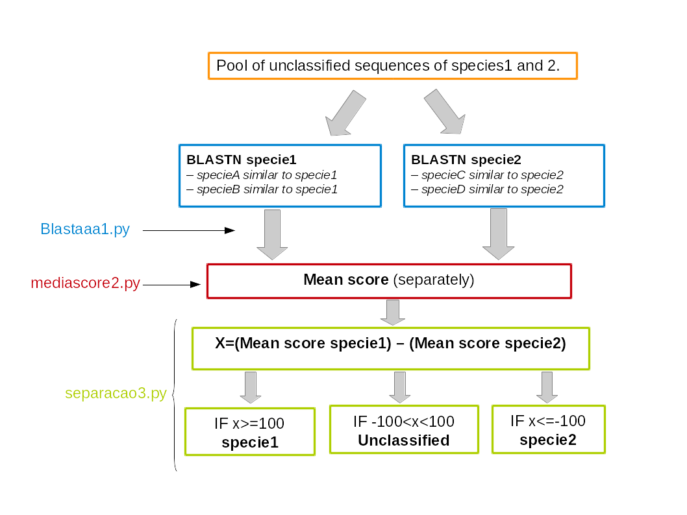

# SpeciesSplit

This set of scripts based on [Fernandez et al 2012](http://www.ncbi.nlm.nih.gov/pubmed/21726390) can be used to separate sequences of two known species based on homologies, using blast outfmt=1.

##Usage:

In the command line:

1. Use blastaaa1.py to parse the blastn output
<pre><code>python3 blastaaa1.py -in blastoutput.txt -out outfileblastaaa
</code></pre>

2. Use mediascore2.py to do a mean score of two different sets of hits already processed by blastaaa1.py. For example, you have coffea arabica sequences but their is very litle number of sequences of that species, you may use other coffee species sequences, in a separate homologie search.
<pre><code>python3 mediascore2.py  -in1 outputfileblastaaa1 -in2 outputfileblastaaa2 -out mediascore_output
</code></pre>

3. Use separacao3.py to calculate X and separate the sequences in 3 files: specie1, specie2 and not categorized. This uses the mediascore2.py output of the homologie searches against the two different species. The output is organized as Gene name - X value.
<pre><code>python3 separacao3.py  -in1 mediascore_output_specie1 -in2 mediascore_output_specie1 -out1 specie1_categorized -out2 specie2_categorized -outincert not_categorized
</code></pre>

##License:

GPLv2

